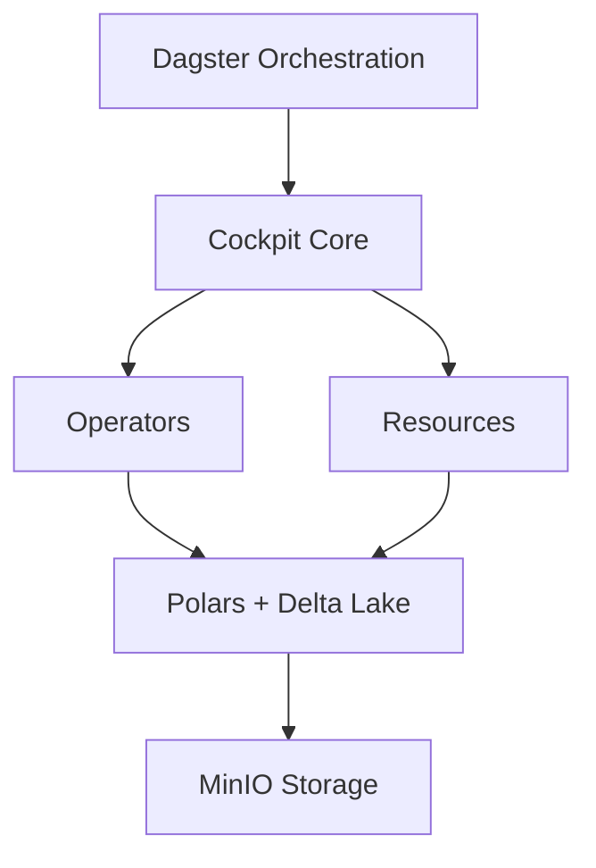

# Architecture

## Layers

## Components

| Module | Role |
|--------|------|
| `core/` | Pipeline and asset definitions |
| `operators/` | Data transformation operators |
| `resources/` | External resources (Delta Lake, MinIO) |

## Data Flow

1. **Dagster** orchestrates pipelines defined in Cockpit
2. **Pandera** validates DataFrames against contracts
3. **Polars** processes data efficiently
4. **Delta Lake** provides ACID storage with time travel
